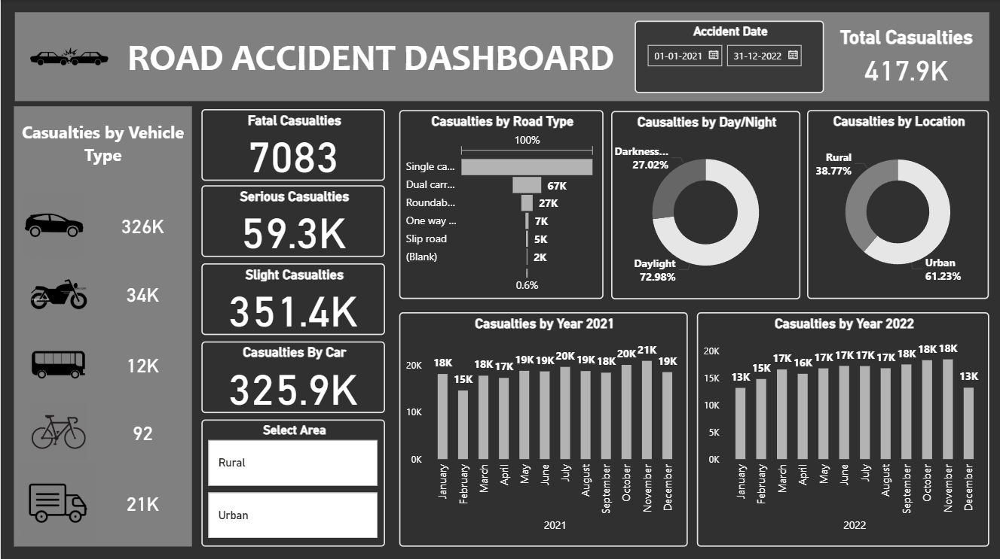

# Road-Accident-Dashboard-using-Power-BI
Interactive Power BI dashboard analyzing road accident casualties (2021–2022).

## Project Overview
This Power BI project analyzes road accident data from 2021 to 2022 to identify trends in casualties by vehicle type, road type, time of day, location, and severity.

## Tools & Technologies
- Power BI
- DAX
- Power Query
- Data Modeling
- CSV / Excel Dataset

## Dashboard Highlights
- Total casualties: 417.9K
- Fatal, Serious, and Slight casualty breakdown
- Casualties by vehicle type
- Road type analysis (single carriageway, dual carriageway, roundabout, etc.)
- Day vs Night accident comparison
- Urban vs Rural casualties
- Year-wise monthly trends (2021 & 2022)
- Interactive filters for date and area

## Dashboard Preview

## Key Insights
- Majority of accidents occur during daylight hours
- Urban areas record higher casualties than rural areas
- Cars contribute the highest number of casualties
- Single carriageways are the most accident-prone road type

## Conclusion
This dashboard helps identify high-risk conditions and supports data-driven road safety decisions.

---
Created by **Dhanshree Kawade**
